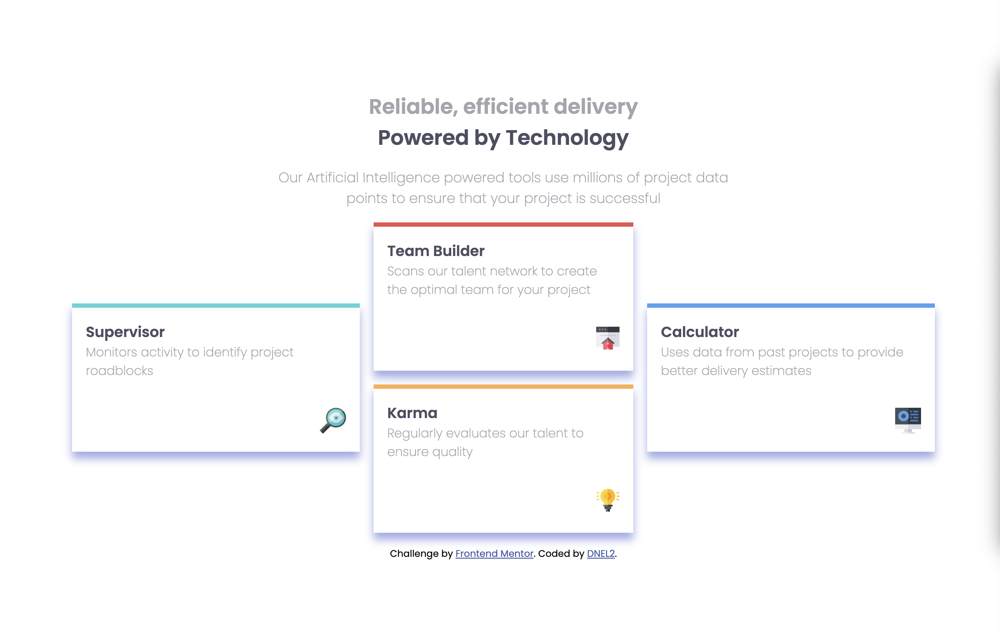

# Frontend Mentor - Four card feature section solution

This is a solution to the [Four card feature section challenge on Frontend Mentor](https://www.frontendmentor.io/challenges/four-card-feature-section-weK1eFYK). Frontend Mentor challenges help you improve your coding skills by building realistic projects. 

## Table of contents

- [Overview](#overview)
  - [The challenge](#the-challenge)
  - [Screenshot](#screenshot)
  - [Links](#links)
- [My process](#my-process)
  - [Built with](#built-with)
  - [What I learned](#what-i-learned)
  - [Continued development](#continued-development)
  - [Useful resources](#useful-resources)
- [Author](#author)
- [Acknowledgments](#acknowledgments)

## Overview

### The challenge

Users should be able to:

- View the optimal layout for the site depending on their device's screen size

### Screenshot

### Links

- Solution URL: [Add solution URL here](https://github.com/TechEdDan2/FourCardFeature)
- Live Site URL: [Add live site URL here](https://techeddan2.github.io/FourCardFeature/)

## My process

### Built with

- Flexbox
- Mobile First - I started with the mobile view and then changed to desktop.
- Bootstrap - I just played around with bootstrap a little here, but ended up removing it. 

### What I learned

This was good practice for layout.

### Continued development

I would like to try this using a framework or other approach in the future to practice those skills. I started to use Bootstrap, but ended up taking it out. I would also like to figure out how others determined spacing and size of the elements. 

### Useful resources

- [MDN](https://developer.mozilla.org/en-US/docs/Web/API/Document_Object_Model) - This always helps

## Author

- Frontend Mentor - [@TechEdDan2](https://www.frontendmentor.io/profile/TechEdDan2)
- X (Twitter) - [@TechEdDan](https://twitter.com/TechEdDan)

## Acknowledgments

I have been completing courses created by Colt Steele and Daniel Walter Scott, and use CSS Tricks, W3Schools and MDN to find answers to questions.  

